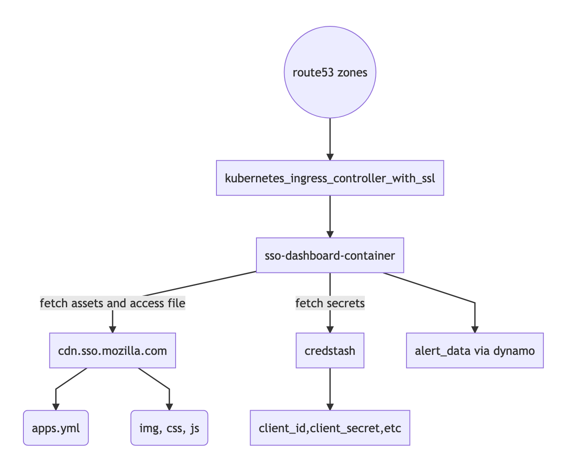
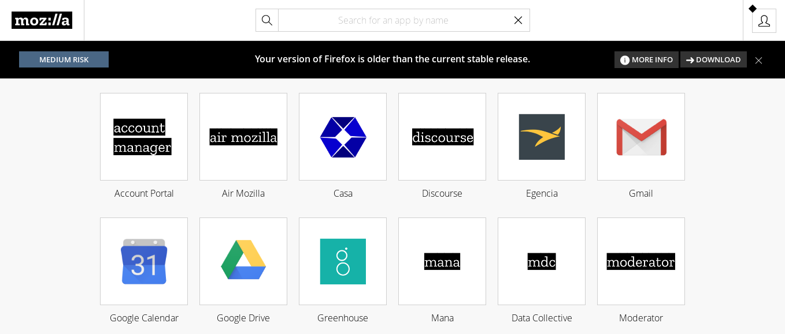

[](https://github.com/pre-commit/pre-commit)

# Mozilla-IAM Single Sign-On Dashboard

A Python Flask implementation of an SSO dashboard with OIDC for authentication.



> High-Level Architecture Diagram of the Dashboard and related services. Diagram source is available [here](docs/architecture.mermaid).



> The dashboard prototype as it exists today. This screenshot will be updated as the dashboard UI evolves.

# Contributors

* Jake Watkins [:dividehex] jwatkins@mozilla.com
* Andrew Krug [:andrew] akrug@mozilla.com

# Projects used by this Project

* Flask
* Redis
* Jinja
* Flask-SSE
* Gunicorn
* MUI-CSS Framework
* Docker

# Features

* Control over what apps a user sees
* User profile editor
* Vanity URLs for applications
* Quick search for locating and opening applications

# Authentication Flow

All authentications are performed through Auth0 for all users.

# Authorization Flow

This app does not technically provide authorization. However, it does check a file using rule syntax to determine what applications should be in the user's dashboard. The rule file exists in _dashboard/data/apps.yml_.

## Sample Rule File Syntax

```
---
apps:
  - application:
      name: "Demo App 1"
      op: auth0
      aal: LOW
      url: "https://foo.bar.com"
      logo: "auth0.png"
      authorized_users: []
      authorized_groups: []
      display: false
      vanity_url:
      - /demo
```

> During authorization, the app checks the user's group membership. If a user is a member of the required groups and they exist in their profile, the user is shown the icon.

__Note: The display false attribute will cause the app not to be displayed at all under any circumstance. This exists largely to facilitate dev apps or app staging and then taking apps live.__

# Adding Apps to the Dashboard

To add applications to the dashboard, create an application entry in the `apps.yml` file and add a logo under the images directory.

[https://github.com/mozilla-iam/sso-dashboard-configuration](https://github.com/mozilla-iam/sso-dashboard-configuration)

# Logos

These are the rules for the logos. They have to conform to some standards due to the fact they are in a responsive grid.

1. Logos should be 120px by 40px (or same aspect).
2. Logos should be in .png format.

# Development Guide

For more information on developing features for the SSO Dashboard, see the [development guide](docs/development.md).

# Deployment

This section gives an overview of the SSO Dashboard deployment. For a more detailed explanation, check [this document](https://github.com/mozilla-iam/iam-infra/blob/74a68749db6f9043bdd36970d0e94de322cd9804/docs/runbooks/sso-dashboard.md).

The Single Sign-On (SSO) Dashboard runs on GCP Cloud Run and is automatically deployed to a Cloud Deploy pipeline via GitHub Actions upon merging to the master branch. Once deployed to Cloud Deploy, it becomes immediately available in the Cloud Run development environment for smoke testing. The IAM team can then promote the build from development to staging for further testing, and subsequently to production when ready.

Cloud Run environments:
 - Production environment can be reached at https://sso.mozilla.com
 - Staging environment can be reached at https://staging.sso.mozilla.com
 - Development environment can be reached at https://sso.allizom.org

Each Cloud Run environment's settings are located in the `clouddeploy` directory.
