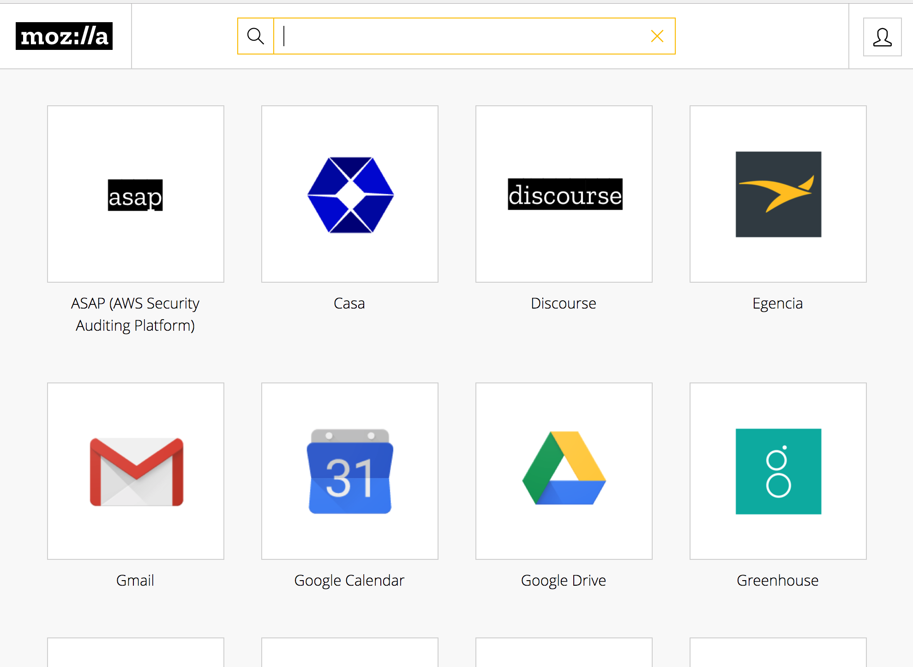

# Mozilla-IAM Single Sign On Dashboard
A python flask implementation of an SSO dashboard.  OIDC for authentication and message bus for alert pipelines.

[](https://travis-ci.org/mozilla-iam/sso-dashboard)


> High Level Architecture Diagram of the Dashboard and related services.  Diagram source is available in [source available here](docs/architecture.mermaid).


> Above is the dashboard prototype as it exists today. This screenshot will be updated as the dashboard UI evolves.

# Contributors

* Jake Watkins [:dividehex] jwatkins@mozilla.com
* Andrew Krug [:andrew] akrug@mozilla.com

# Projects this Project Uses

* Flask
* Redis
* Jinja
* Flask-SSE
* Gunicorn
* MUI-CSS Framework
* Docker

# Features

* Server Side Events Security Alerts
* Control over what apps a user sees
* User profile editor
* Global Security Alerts
* IHaveBeenPwned Integration

# Authentication Flow

All authentications are performed to auth0.  Due to the nature of the Application
this will be restricted to Mozilla LDAP login only until the "enriched profile"
is complete.

# Authorization Flow
This app does not technically provide authorization.  It does however check a
file using rule syntax to determine what applications should be in the users
dashboard.  The rule file exists in _dashboard/data/apps.yml_.

## Sample rule file syntax

```
---
apps:
  - application:
      name: "Demo App 1"
      op: okta
      url: "https://foo.bar.com"
      logo: "static/img/auth0.png"
      authorized_users: []
      authorized_groups: []
      display: false
```

> During authorization the app checks the users ldap group membership if a user
is member of the required ldap group and it exists in their profile the user is
shown the icon.

__Note: The display false attribute will cause the app not to be displayed at
all under any circumstance.  This exists largely to facilitate dev apps or
app staging and then taking apps live.__

# Adding apps to the Dashboard

In order to add applications to the dashboard there is an apps.yml file and
a logos directory that exists in the Mozilla-IAM github org.

https://github.com/mozilla-iam/sso-dashboard-configuration

# Logos
These are the rules of the logos.  They have to conform to some standards due
to the fact they are in a responsive grid.

1. Logos should be uploaded to s3 bucket
2. Logos should 120px by 40px ( or same aspect )
3. Logos should be .png

# Development Guide

For more information on developing features for the sso-dashboard see the [development guide](docs/development.md).

# Deployment
This section gives an overview of the SSO Dashboard deployment, for a more detailed explanation check [this document](https://github.com/mozilla-iam/iam-infra/blob/74a68749db6f9043bdd36970d0e94de322cd9804/docs/runbooks/sso-dashboard.md).

Single Sign On Dashboard (SSO Dashboard) runs in the AWS IAM account (320464205386) inside the production EKS cluster, however it uses resources in the `infosec-prod` and `infosec-dev` AWS accounts.

Currently the application is deployed into 2 different environments: dev and prod, each one running in the correspondent Kubernetes namespaces.
 - Production environment can be reach at https://sso.mozilla.com
 - Staging environment can be reached at https://staging.mozilla.com
 - Development environment can be reach at https://sso.allizom.org

The application deployment process is performed by AWS Codebuild following the instructions in the [buildspec file](https://github.com/mozilla-iam/sso-dashboard/blob/master/buildspec-k8s.yml), which is heavily dependent in this [Makefile](https://github.com/mozilla-iam/sso-dashboard/blob/master/Makefile).

Deployments are automatically triggered after merging to different git braches:
 - When a new merge to `master` branch happens, Codebuild will detect it and will run the `sso-dashboard` job, effectively deploying the code to the `dev` environment.
 - When a new merge to `production` branch happens, Codebuild will detect it and run the `sso-dashboard` job, effectively deploying the code to the `prod` environment.

Deployments history and logs of them can be seen in: AWS console -> Codebuild -> sso-dashboard [direct link](https://us-west-2.console.aws.amazon.com/codesuite/codebuild/projects/sso-dashboard/history?region=us-west-2).
