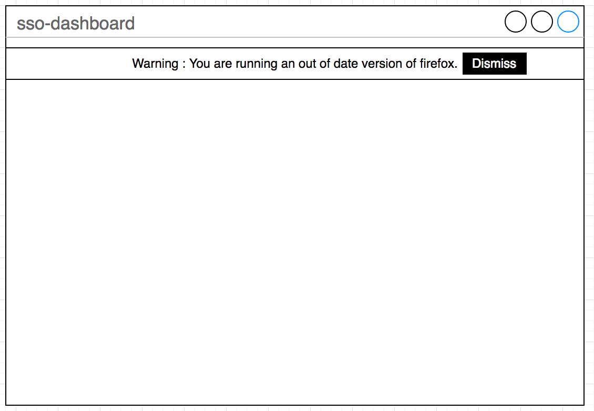
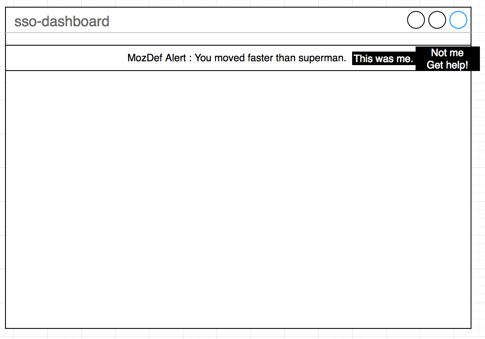

# Alert Center

## Alert Center Purpose

The security alert center will inform users of the sso-dashboard users with information about their security posture, important changes, etc.
Security alerts are categorized by risk levels as defined in the [Standard Levels](https://wiki.mozilla.org/Security/Standard_Levels)

### What is an alert

An alert is a small notification message for the user, which is meant to alert the user of an event. The alert is not necessarily security-relevant.
The alert may be purely informational, or be acted upon (such as with "confirm, ask for help, alert someone" buttons).
It is also important to understand the alert may not always been seen by the user.

### Alert risk level

The alert risk levels are standardized and defined at [Standard Levels](https://wiki.mozilla.org/Security/Standard_Levels) 

This is a summary for convenience (refer to the above link for up-to-date 'official' information and complete definitions).

- __UNKNOWN risk (white  `#ffffff`)__: Most likely to be unused in this context.
- __LOW risk (grey  `#cccccc`)__: Most likely to be unused in this context.
- __MEDIUM risk (blue `#4a6785`)__: There could be a problem, attention is expected from the user. Ex: "You have logged in from a new location".
- __HIGH risk (yellow  `#ffd351`)__: There is a problem and it looks bad. User interaction required. Ex: "Your user logged in on a new system. Was it really you?".
- __MAXIMUM risk (red  `#d04437`)__: We're probably trying to call you on the phone right now, and find your physical whereabouts.  Ex: "We know for a fact that your service is compromised".

__NOTE__: It is possible to add alerts that are not risk related but instead purely information for UX reasons. All security alerts must use the standard risk levels.

### Alert Schema

> As an enterprise infosec service (machine/software) I can send an alert for "All Users" or an individual and it should show the alert in near real time in the related user(s) dashboard.

```
alert:
  risk: unknown|low|medium|high|maximum  # Required: How important the alert is. Unknown and low risk alerts may not have a button displayed with the alert.
  summary: "Your just moved faster than superman." # Required: The alert.
  description: "A large amount of information that may be about what has happened." # Optional: Additional information about the alert.
  date: 07:07:07 6/26/17 GMT -8 # Optional: date and time at which the alert event occured.
  url: "https://wiki.example.com/geolocation/alert" # Optional: an URL rendered on a button next to the alert.
  url_title: "More Info" # Optional: If an URL is set, this is the URL title.
```

### Alert UI (notification bar)

Unknown and low risk alerts may not have a risk level indicator associated. These may be informational messages that do not carry any perceived risk.

__Unknown and low risk alerts__



Medium, high and maximum risk alerts have buttons to acknowledge them as false-positive or to request help. If the alert is acknolwedged as false-positive, a 2FA prompt must be validated before continuing. This makes it more difficult for someone with access to the user session to flag alerts as false-positive.

> The labeling, colors, etc. is to be updated in the example below.

__Medium, high and maximum risk alerts__


### Alert Center

The alert center possess the same information available as the notification bar with additional information taken from the `description` field of the alert schema.
Users can acknowledge false-positives or dismiss all alerts from the alert center as well. It also shows an history of recent alert notifications.

## Additional considerations

### Amount of alerts

We want to account for a user having a lot of alerts all at once.
Let's say that as a user I am part of a major data breach, my house gets robbed, and attackers are logging in with one of my 2FA device(s) and password all over the globe.
Instead of spamming the user, there should be a single dialog aggregating all alerts, such as:

> Important: You have 52 high and maximum risk alerts. View notification center.  _or something like that_ 
